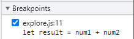
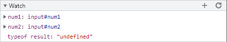
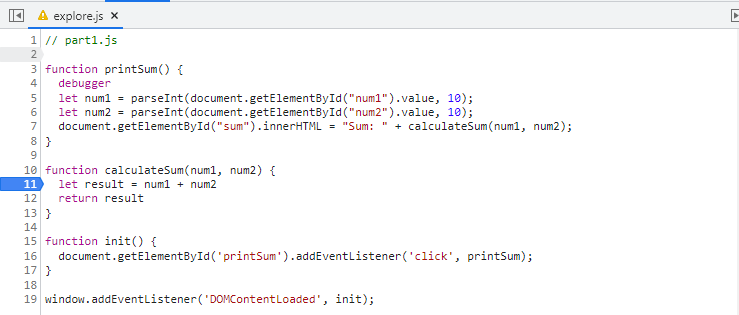

# devTools Part 2
1. The bug was that num1 and num2 are being added as strings not integers.  
  
 
2. My fix would be to use the parseInt function to save num1 and num2 as integers so that they are added numerically.
